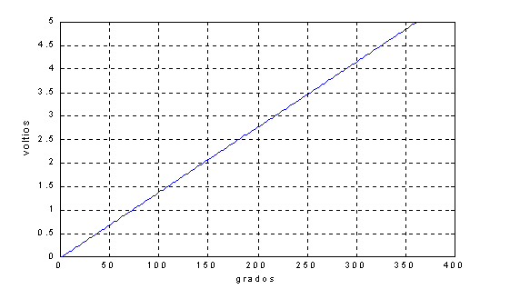
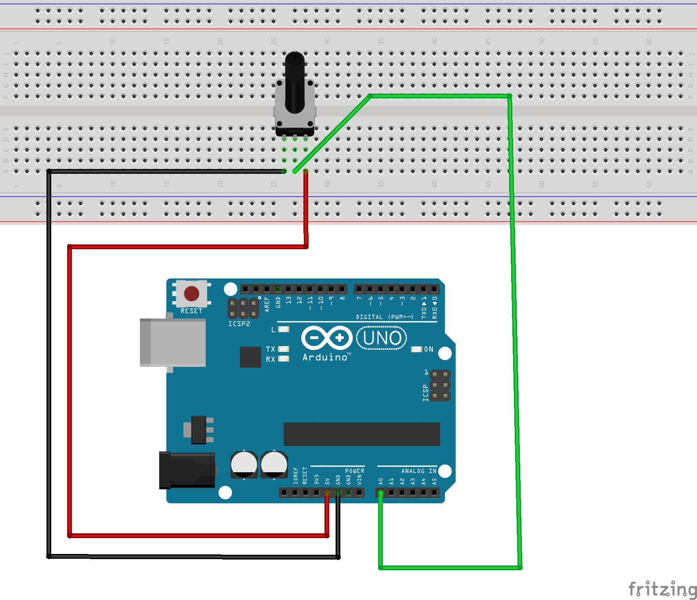

#Resumen SENSOR ANGULAR DE POSICIÓN

##POTENCIÓMETRO

Elemento electromecánico que permite ajustar el potencial eléctrico entre 2 de sus terminales, en función de la posición angular de un eje de rotación (o de traslación en el caso de elementos del tipo lineal).

Los usos pueden ser muy variados y alcanzan tanto la selección manual de un nivel, por ejemplo para el control de volumen, intensidad de luz, nivel de temperatura, etc., asi como para ajustar una posición o ubicación, por ejemplo en un joystick. También se lo emplea como detector de posición en el caso de servomotores.

El funcionamiento se basa, por lo general, en la disposición de un cursor o contacto eléctrico central que se desliza sobre una pista (circular o lineal) compuesta de un material resistivo.

Desde el punto de vista eléctrico, se comporta o es equivalente a un DIVISOR DE TENSIÓN DE TIPO RESISTIVO, cuya proporción de división será una función de la posición del cursor.

 

La relación entre la tensión o voltaje o potenciál eléctrico en los terminales de salida del potenciómetro será una proporción del voltaje de entrada y de la posición del cursor.

En general existen 2 tipos de respuesta, a saber: LINEAL o LOGARITMICA.

## PRACTICA: Conexión a una entrada analógica del procesador

DIAGRAMA DE CONEXIÓN

PROGRAMA

int analogPin = 0;     // Punto medio de potenciometro conectado a entrada A0.

int val = 0;           // Variable con el valor digitalizado de la magnitud analogica en A0

void setup() //Seccion de inicializacion. Se ejecuta solo una vez luego del RESET del procesador

{

  Serial.begin(115200);  // Inicia comunicacion serie como 115200-8-1-N

}

void loop() //Ejecucion continua

{

  val = analogRead(analogPin);    // lee el valor analogico y lo digitaliza en 10bits. 0-1023

  Serial.println(val);             // Mustra en consola serie el valor digitalizado
  
  delay(500);
  
}

