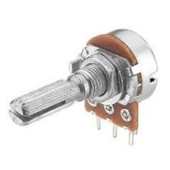
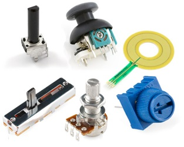
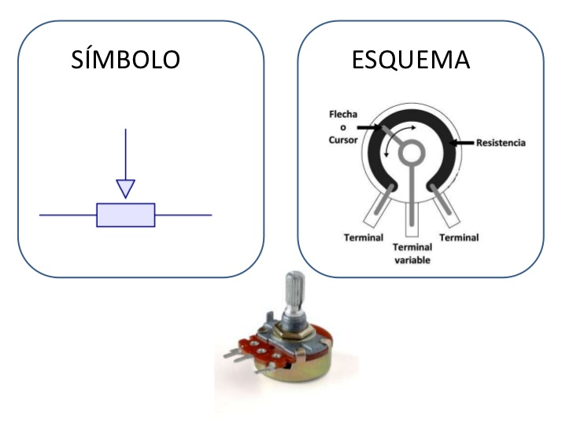
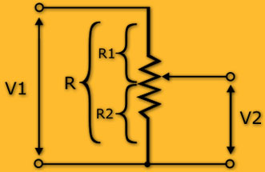
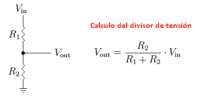

#Resumen

##POTENCIÓMETRO

Elemento electromecánico que permite ajustar el potencial eléctrico entre 2 de sus terminales, en función de la posición angular de un eje de rotación (o de traslación en el caso de elementos del tipo lineal).

Los usos pueden ser muy variados y alcanzan tanto la selección manual de una posición, por ejemplo para el control de volumen, intensidad, etc., como para ajustar una posición o ubicación, por ejemplo en un joystick. También se lo emplea como detector de posición en el caso de servomotores.

El funcionamiento se basa, por lo general, en la disposición de un cursor o contacto eléctrico central que se desliza sobre una pista (circular o lineal) compuesta de un material resistivo.

Desde el punto de vista eléctrico, se comporta o es equivalente a un DIVISOR RESISTIVO, cuya proporción de división está una función de la posición del cursor

 
