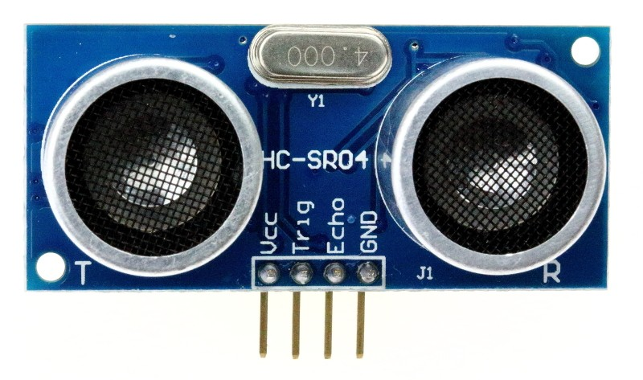
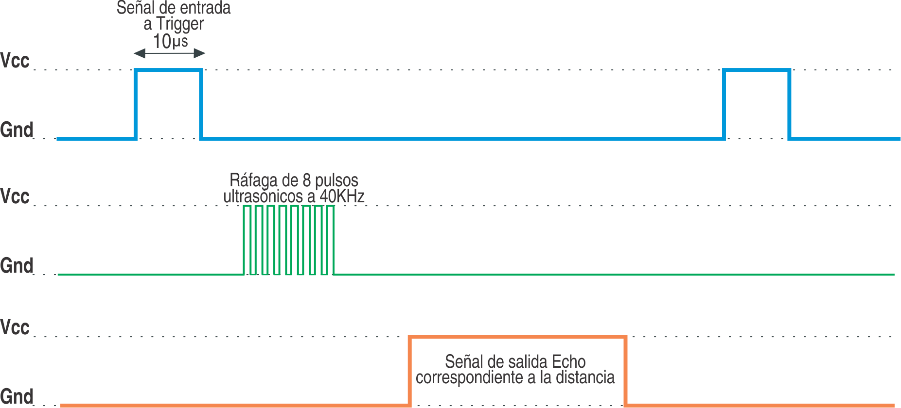

#Resumen SENSOR DE DISTANCIA

##Sensor de distancia por ultrasonido SR04

El HC-SR04 es un sensor de distancias por ultrasonidos capaz de detectar objetos y calcular la distancia a la que se encuentra en un rango de 2 a 450 cm. El sensor funciona por ultrasonidos y contiene toda la electrónica encargada de hacer la medición. Su uso es tan sencillo como enviar el pulso de arranque y medir el ancho o duración del pulso de retorno. De muy pequeño tamaño, el HC-SR04 se destaca por su bajo consumo, gran precisión y bajo precio.

##Características

Dimensiones del circuito: 43 x 20 x 17 mm

Tensión de alimentación: 5 Vcc

Frecuencia de trabajo: 40 KHz

Rango máximo: 4.5 m

Rango mínimo: 1.7 cm

Duración mínima del pulso de disparo (nivel TTL): 10 μS.

Duración del pulso eco de salida (nivel TTL): 100-25000 μS.

Tiempo mínimo de espera entre una medida y el inicio de otra 20 mS.

###Pines de conexión:

VCC (+5 Volt)

Trig (Disparo del ultrasonido)

Echo (Eco o Recepción del ultrasonido)

GND

##Funcionamiento

El módulo dispone de emisor y receptor de ultrasonido, así como los circuitos para enviar un sonido de alta frecuencia y amplificar la recepción del eco. Esta recepción es acondicionada como una salida de estado binario de tiempo variable. El tiempo del pulso de salida es proporcional al tiempo de retorno del sonido emitido.

El siguiente diagrama de señales en el tiempo resume el proceso

###Ecuación de conversión

Distancia = {(Tiempo entre Trig y el Eco) * (V.Sonido 340 m/s)}/2

#PRACTICA: Conexión para medición de distancia

DIAGRAMA DE CONEXIÓN

PROGRAMA

