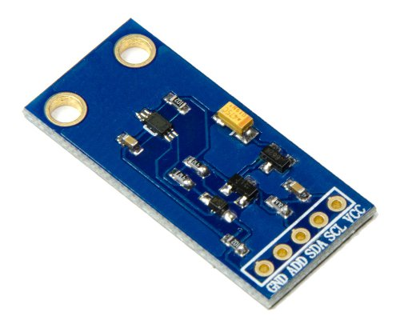
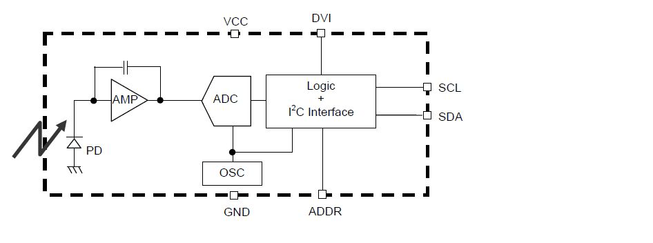
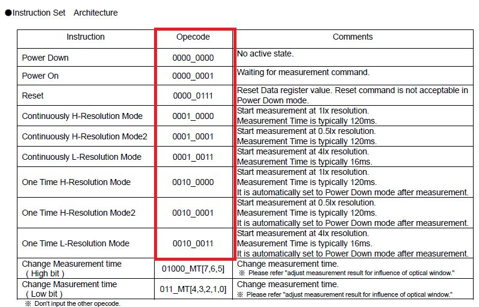
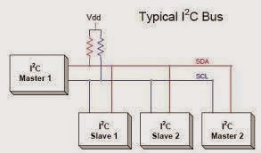
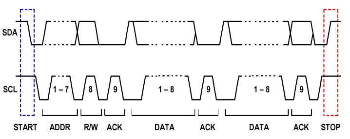

#Resumen SENSOR DE LUZ

##Sensor digital de luz BH1750

Módulo para la medición de la intensidad de luz, generalmente aplicado en medición de luz ambiente. Contiene el circuito integrado especializado y otros componentes de interfaz.

El control y salida de datos es por medio de una interfaz de interconexión denominada I2C que permite configurar una verdadera red de dispositivos, tanto en el modo Maestro / Esclavo como Multi-Maestro / Multi-Esclavo. 

###Diagrama en bloques

###Comandos

###Caracteristicas Técnicas

Interfaz digital a través de bus I2C con capacidad de seleccionar entre 2 direcciones

Respuesta espectral similar a la del ojo humano

Reliza mediciones de luz y convierte el resultado a una palabra digital

Amplio rango de medición 1-65535 lux

Modo de bajo consumo de energía

Rechazo de ruido a 100/120 Hz

Baja dependencia de la medición contra la fuente de luz: halógeno, led, incandescente, luz de día, etc.

La influencia del espectro infrarojo es baja.

Voltaje de alimentación desde 3.3v hasta 5v

##Interfaz digital I2C

Se implementa con 2 señales de control: SCL para sincronización (pin A5 de ARDUINO) y SDA (pin A4 de ARDUINO) para entrada/salida de datos, es decir, SDA oficia tanto de salida de bits de datos como de entrada de bits de datos en función del tipo y estado de operación del bus en un momento y para un par de dispositivos dado. Los niveles eléctricos de las señales corresponden con los estados lógicos. Las velocidades de sincronización son 100 o 400KHz. Los datos son serializados sobre una única linea de datos (SDA) común para todos los dispositivos conectados. El componente designado como MAESTRO es el encargado de generar la señal de sincronización SCL que, para los elementos ESCLAVOS es siempre una entrada. Todos y cada uno de los elementos esclavos tienen una única dirección. Las operaciones y estados aceptados en el protocolo son:

START
STOP
READ
WRITE
ACK (o NOACK)

Diagrama de interconexión de dispositivos compatibles con I2C

Diagrama temporal del protocolo I2C

##PRÁCTICA: Medición de intensidad de luz en LUX (Luxómetro)

DIAGRAMA DE CONEXIONES

La asignación de terminales en ARDUINO es: A4 (SDA) A5 (SCL)

PROGRAMA

[LIBRERIA](https://github.com/Genotronex/BH1750FVI_Master)
