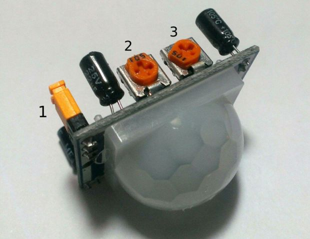

#Resumen SENSOR DE MOVIMIENTO

##Sensor de movimiento por radiación infrarroja

El módulo SR501 contiene toda la electrónica para indicar, por la activación de un terminal de salida, que un objeto con cierto nivel de temperatura se ha movido dentro de su rango de alcance y sensibilidad.  El funcionamiento se basa en el circuito integrado RB200 que incluye 2 elementos detectores pasivos de radiación infrarroja gemelos.

La diferencia entre las energías que inciden en cada uno de los sensores es amplificado y acondicionado para activar la salida.  La particularidad del RB200 es que si las diferencias de energía recibidas se equilibran en el tiempo, la diferencia es nula y por lo tanto no hay señal de salida. Esta es la razón por la cual es un sensor de movimiento o variaciones y no de presencia.

El módulo HC-SR501 tiene 3 pines de conexión +5v, OUT y GND, dos resistencias variables de calibración (2 y 3) y un puente de ajuste (1).

3: Con esta resistencia podemos establecer el tiempo que se va a mantener activa la salida del sensor. El tiempo mínimo que se puede establecer es de más o menos 3s.

2: Esta resistencia variable nos permite establecer la sensibilidad, o sea, la distancia de detección; puede variar entre 3-7m.

1: Este puente permite elegir el redisparo del tiempo de activación o no.

###Características

Sensor piroeléctrico (Pasivo) infrarrojo (También llamado PIR)

El módulo incluye el sensor, lente, controlador, regulador y todos los componentes de apoyo.

Rango de detección: 3 m a 7 m, ajustable mediante trimmer (Sx)

Lente fresnel de 19 zonas, ángulo < 100º

Salida activa alta a VCC

Tiempo en estado activo de la salida configurable mediante trimmer (Tx)

Redisparo configurable mediante jumper (1)

Consumo de corriente en reposo: < 50 μA

Voltaje de alimentación: 4.5 VDC a 20 VDC

#PRÁCTICA: Sensar movimiento

DIAGRAMA DE CONEXIÓN

PROGRAMA

