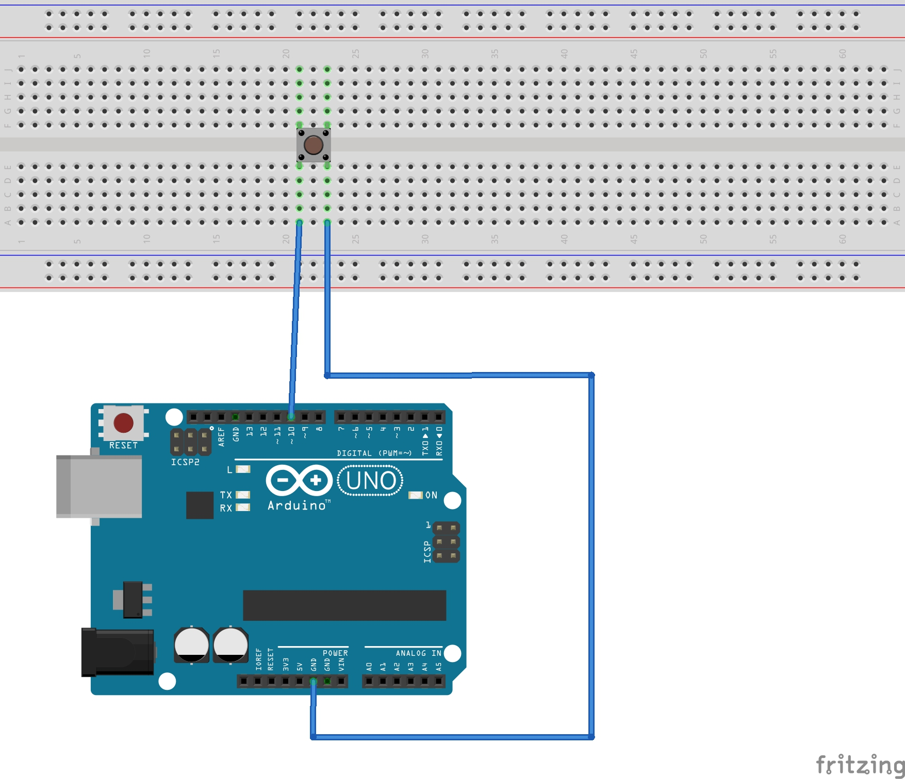

# Resumen PULSADOR - FINAL DE CARRERA

Elemento electromecánico destinado a sensar la posición de un objeto de manera mecánica o detectar la acción o movimiento sobre un elemento actuador aislado.

## TIPOS

PULSADOR ELECTRÓNICO

PULSADOR o LLAVE ELÉCTRICA

FIN DE CARRERA

## FUNCIONAMIENTO

Funciona como una llave o interruptor eléctrico, permitiendo o impidiendo la circulación de corriente eléctrica a través de él 
en función de la posición de un contacto eléctrico movido mecánicamente.

## CONEXIÓN AL MICROCONTROLADOR

La posición del pulsador se traduce en un estado lógico de entrada HIGH ("1") o LOW ("0") según el potencial eléctrico aplicado en una de las conexiones o terminales digitales del controlador, comunmente llamado "pin".

Al conectar la entrada digital a la tensión de alimentación (+5Volt) lo que se representa o lee es el estado lógico "1" o HIGH en la entrada. Al conectar la entrada digital a TIERRA (GND o 0Volt) lo que se representa o lee es el estado lógico "0" o LOW en la entrada.

## [PUERTOS DE ENTRADA/SALIDA DIGITAL](https://www.arduino.cc/en/Tutorial/DigitalPins)

Detalle sobre puertos de entrada salida de uso general en el procesador ATMEGA328

"Section 4.1 I/O port pins and their functions

• The ATmega328P has 23 General Purpose Digital I/O Pins assigned to 3 Ports (8-bit Ports B, D and 7-bit Port C)
• Each I/O port pin may be configured as an output with symmetrical drive characteristics. Each pin driver is strong enough (20 mA) to drive LED displays directly.
### • Each I/O port pin may be configured as an input with or without a pull-up resistors. The values for the pull up resistors can range from 20 - 50 K ohms.

• Each I/O pin has protection diodes to both VCC and Ground"

## PROGRAMACIÓN DE PUERTOS DE ENTRADA

...

OPCION 1) 

// Designar inPin como ENTRADA DIGITAL. inPin=NUMERO ASIGNADO 0-13 (-18*)

pinMode(inPin, INPUT);           // set pin to input

// Activar la resistencia interna como PULL UP

digitalWrite(inPin, HIGH);       // turn on pullup resistors

OPCION 2)

pinMode(inPin, INPUT_PULLUP); 

//lectura del estado del pin designado como entrada digital

int val = digitalRead(inPin);   // read the input pin

...

## PRACTICA: Cambiar el estado de una salida

### DIAGRAMA

### PROGRAMA

int ledPin = 13; // LED connected to digital pin 13

int inPin = 10;   // pushbutton connected to digital pin 10

int val = 0;     // variable to store the read value

void setup()

{

  pinMode(ledPin, OUTPUT);      // sets the digital pin 13 as output
  
  pinMode(inPin, INPUT_PULLUP);      // sets the digital pin 10 as input
  
}

void loop()

{

  val = digitalRead(inPin);   // read the input pin
  
  digitalWrite(ledPin, val);    // sets the LED to the button's value
  
}

##PRÁCTICA: Ruido eléctrico en contactos - DEBOUNCING

###PROGRAMA

byte datos[100];

void setup() {

  // put your setup code here, to run once:
  
  Serial.begin(115200);
  
  Serial.println("INICIO");

  pinMode(8, INPUT_PULLUP);
  
  pinMode(13, OUTPUT);

}

void loop() {

  // put your main code here, to run repeatedly:
  
  Serial.println("\r\nBOTON ABIERTO");
  
  while (digitalRead(8))
  {
    ;
  }

  for (byte i = 0; i < 100; i++)
  
  {
  
    datos[i] = digitalRead(8);
    
  }

  for (byte i = 0; i < 100; i++)
  
  {
  
    Serial.print(datos[i]);
    
    delay(10);
    
  }

  Serial.println("\n\rBOTON CERRADO");
  
  while (!digitalRead(8))
  {
    ;
  }

  for (byte i = 0; i < 100; i++)
  
  {
  
    datos[i] = digitalRead(8);
    
  }

  for (byte i = 0; i < 100; i++)
  
  {
  
    Serial.print(datos[i]);
    
    delay(10);
    
  }
  
}

[LIBRERIA RBD](https://github.com/alextaujenis/RBD_Button)
