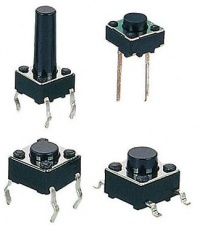
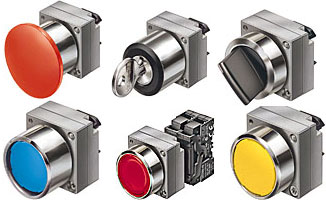
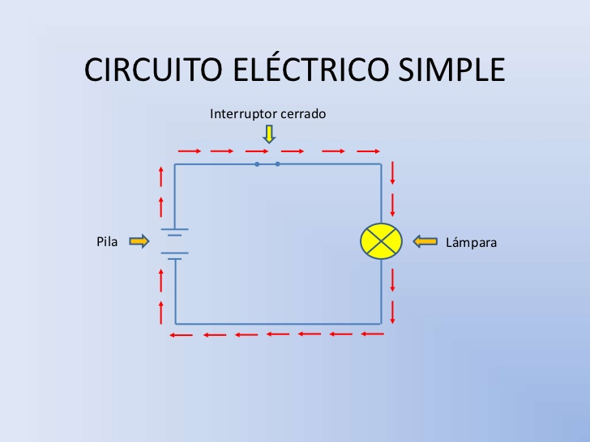
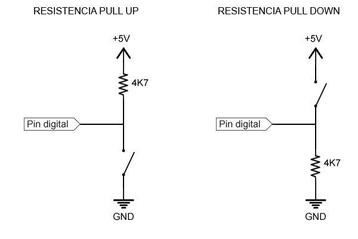
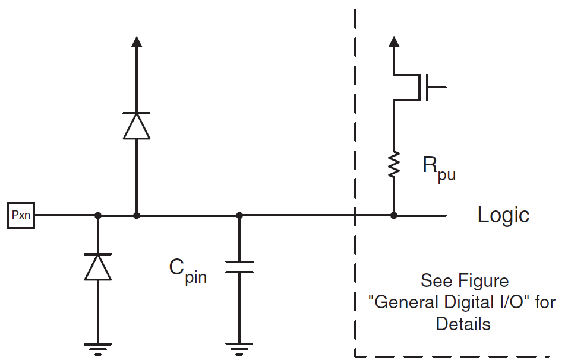

# Resumen PULSADOR - FINAL DE CARRERA

Elemento electromecánico destinado a sensar la posición de un objeto de manera mecánica o detectar la acción o movimiento sobre un elemento actuador aislado.

## TIPOS

PULSADOR ELECTRÓNICO

PULSADOR o LLAVE ELÉCTRICA

FIN DE CARRERA

## FUNCIONAMIENTO

Funciona como una llave o interruptor eléctrico, permitiendo o impidiendo la circulación de corriente eléctrica a través de él 
en función de la posición de un contacto movido mecánicamente.

## CONEXIÓN AL MICROCONTROLADOR

La posición del pulsador se traduce en un estado lógico de entrada HIGH o LOW según el potencial eléctrico en una de las conexiones o terminales digitales del controlador.

Al conectar la entrada digital a la tensión de alimentación (+5Volt) lo que se representa o lee es el estado lógico "1" o HIGH en la entrada. Al conectar la entrada digital a TIERRA (GND o 0Volt) lo que se representa o lee es el estado lógico "0" o LOW en la entrada.

## [PUERTOS DE ENTRADA SALIDA DIGITAL](https://www.arduino.cc/en/Tutorial/DigitalPins)

Detalle sobre puertos de entrada salida de uso general en el procesador ATMEGA328

Section 4.1 I/O port pins and their functions

• The ATmega328P has 23 General Purpose Digital I/O Pins assigned to 3 Ports (8-bit Ports B, D and 7-bit Port C)
• Each I/O port pin may be configured as an output with symmetrical drive characteristics. Each pin driver is strong enough (20 mA) to drive LED displays directly.
### • Each I/O port pin may be configured as an input with or without a pull-up resistors. The values for the pull up resistors can range from 20 - 50 K ohms.

• Each I/O pin has protection diodes to both VCC and Ground

## PROGRAMACIÓN DE PUERTOS DE ENTRADA

...

// Designar inPin como ENTRADA DIGITAL. inPin=NUMERO ASIGNADO 0-13 (-18*)

pinMode(inPin, INPUT);           // set pin to input

// Activar la resistencia interna como PULL UP

digitalWrite(inPin, HIGH);       // turn on pullup resistors

//lectura del estado del pin designado como entrada digital

int val = digitalRead(inPin);   // read the input pin

...
