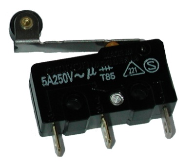

# Resumen PULSADOR - FINAL DE CARRERA

Elemento electromecánico destinado a sensar la posición de un objeto de manera mecánica o detectar la acción o movimiento sobre un elemento actuador aislado.

## TIPOS

PULSADOR ELECTRÓNICO

PULSADOR o LLAVE ELÉCTRICA

FIN DE CARRERA

## FUNCIONAMIENTO

Funciona como una llave o interruptor eléctrico, permitiendo o impidiendo la circulación de corriente eléctrica a través de él 
en función de la posición de un contacto movido mecánicamente.

## CONEXIÓN AL MICROCONTROLADOR

La posición del pulsador se traduce en un estado lógico de entrada HIGH o LOW según el potencial eléctrico en una de las conexiones o terminales digitales del controlador.

Al conectar la entrada digital a la tensión de alimentación (+5Volt) lo que se representa o lee es el estado lógico "1" o HIGH en la entrada. Al conectar la entrada digital a TIERRA (GND o 0Volt) lo que se representa o lee es el estado lógico "0" o LOW en la entrada.

