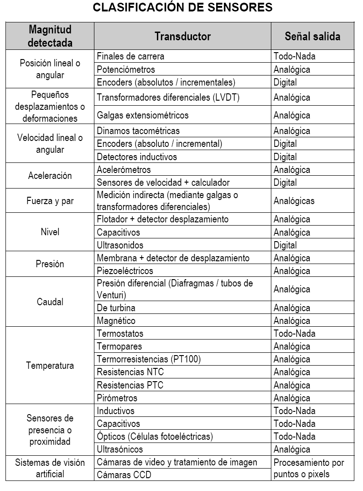

# Sensores

## Resumenes

[Definiciones](http://robots-argentina.com.ar/Sensores_general.htm)

[Aplicaciones](http://www.sensores-de-medida.es/)

### Casos de uso

[Sensor de movimiento](.//MOVIMIENTO_IR/) (por ejemplo HCSR501: PIR salida binaria-TODO/NADA)

[Sensor de ángulo](.//ANGULAR/) (por ejemplo POTENCIÓMETRO: electromecánico salida analógica)

[Sensor de temperatura](.//TEMPERATURA/) (por ejemplo LM35: semiconductor salida analógica)

[Sensor de distancia](.//DISTANCIA/) (por ejemplo HCSR04: eco de pulsos de ultrasonido salida binaria-pulso PWM)

[Sensor de luz](.//LUZ/) (por ejemplo BH1750: foto diodo salida digital-protocolo i2c)

Sensor de aceleración

Sensor de presencia/ausencia

Sensor de presión

Sensores inerciales - Giróscopos

Sensores de fuerza - Células de carga

Sensor acustico
