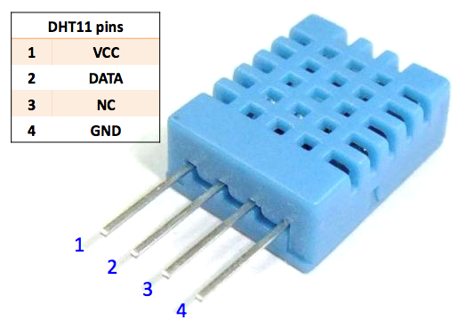

#Resumen SENSOR DE TEMPERATURA

##Sensor Digital DHT11

DHT11 es un circuito integrado capaz de proveer una salida digital  proporcional a la temperatura del circuito.

No requiere de calibración externa y en el rango de la temperatura y humedad ambiente, su presición es del orden del 2-5%.

##Uso de bibioteca

Incorporar [SimpleDHT](https://github.com/winlinvip/SimpleDHT) desde el entorno IDE

##PRÁCTICA: Medición de temperatura y humedad

DIAGRAMA

PROGRAMA

