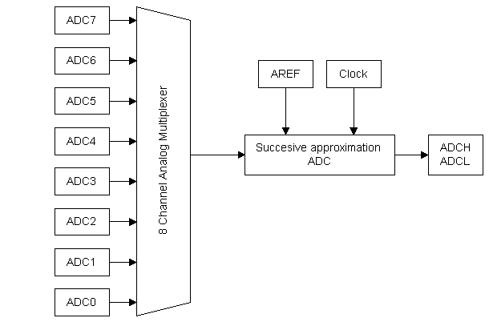
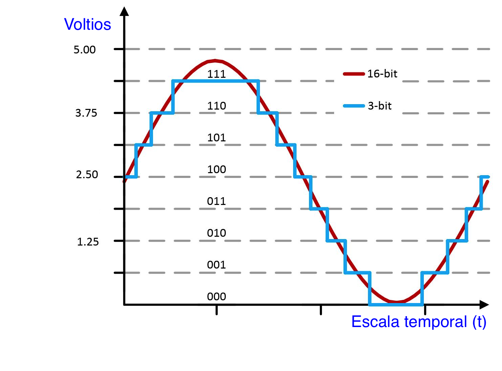
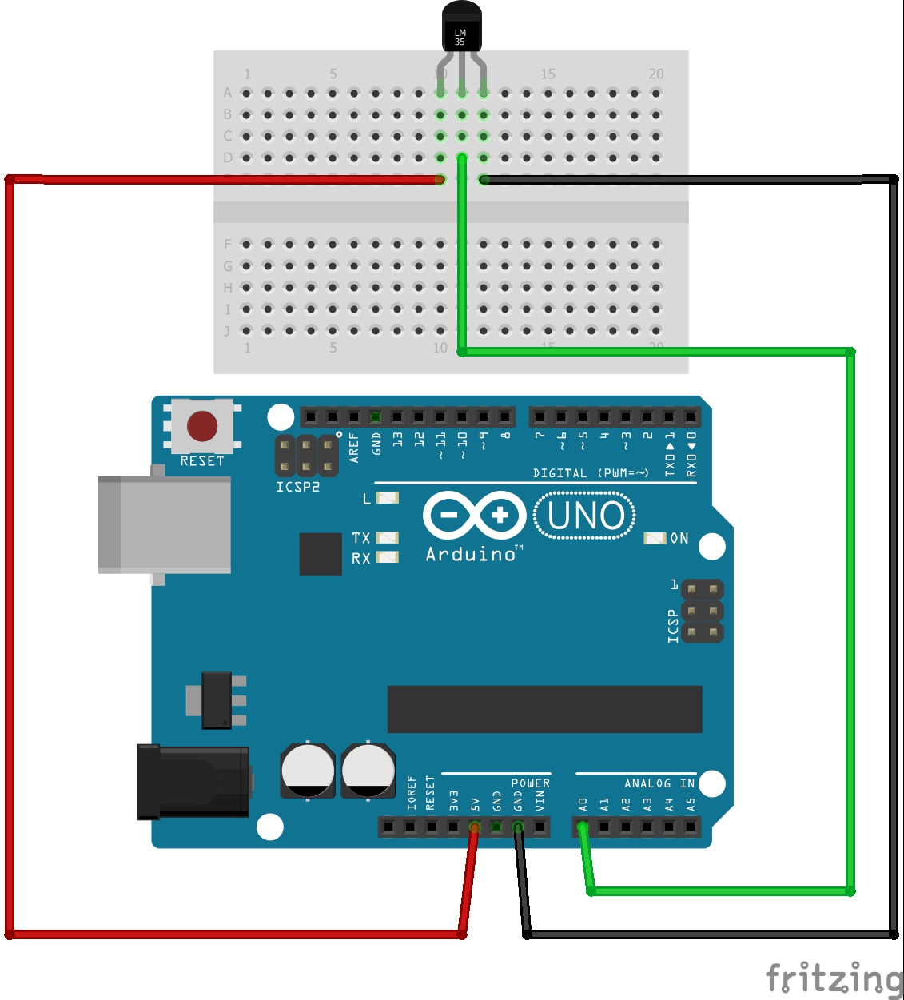

#Resumen SENSOR DE TEMPERATURA

##Sensor Analógico LM35

LM35 es un circuito integrado capaz de proveer una salida de tensión proporcional a la temperatura del circuito.

Capaz de funcionar con un rango amplio de tensiones entre sus terminales de alimentación y que van desde los 4Volts a los 20Volts de diferencia de potencial, asegurando que la tensión o voltaje de salida es una relación constante de 10mV / °C. Por ejemplo, para una temperatura de 25°C la salida será de 250mVolt (milésimas de Volt o 0,250Volt).

El rango de medición de temperaturas para una alimentación simple va desde 0°C hasta 150°C, o sea que su salida puede variar desde 0Volt a 1.500mVolt (1,50Volt).

No requiere de calibración externa y en el rango de la temperatura ambiente, su presición es del orden de 0,25°C.

##Uso del conversor A/D (Analógico a Digital) del procesador

Para la medición de magnitudes analógicas se usará el módulo "ADC" interno al procesador.

La conversión termina en un registro de 10bits, lo que permite obtener un número entre 0 (0X0) y 1023 (0x3FF), que representa una aproximación del valor analógico en uno de los terminales o pines designados como entrada del módulo ADC. Se dice que es una aproximación porque los procesos de conversión digital cuantifican la magnitud de entrada. En nuestro caso, esta cuantificación es de 10bits como máximo.

Los valores de voltaje en las entradas tienen un rango máximo de entre 0V y el valor de la tensión de alimentación del procesador; en nuestro caso es 5Volt.

##analogReference(DEFAULT);

No obstante, hay una referencia o voltaje de referencia, la cual debe ser muy estable, que permite asegurar bajos niveles de error en la conversión. Este valor de referencia es provisto por un circuito interno al procesador y es programable. Así el valor de la conversión obtendrá su máximo valor (1023) cuando el voltaje en la entrada analógica alcance el valor de la referencia. Por defecto, la referencia es interna al procesador y tiene un valor de 5Volt para procesadores alimentados con 5Volt. 

##analogReference(INTERNAL);

Si la estabilidad o el rango de las magnitudes analógicas lo requieren, entonces puede elegirse por programa una fuente interna de referencia de 1,1Volt con estabilidad térmica mejorada (100ppm/°C).  En este caso, para obtener la lectura máxima del registro de conversión (1023) el voltaje de entrada debe ser de 1,1Volt. 

##PRÁCTICA: Conexión a una entrada analógica del procesador

DIAGRAMA

PROGRAMA

void setup()

{

  Serial.begin(115200);
  
}
 
void loop()

{

  int value = analogRead(A0);
  
  float millivolts = (value / 1023.0) * 5000;
  
  float celsius = millivolts / 10; 
  
  Serial.println(celsius);
  
  delay(1000);
  
}
