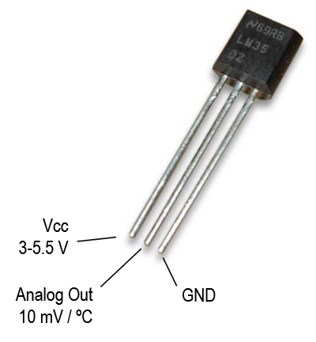

#Resumen SENSOR DE TEMPERATURA

##Sensor Analógico LM35

LM35 es un circuito integrado capaz de proveer una salida de tensión proporcional a la temperatura del circuito.

Capaz de funcionar con un rango amplio de tensiones entre sus terminales de alimentación y que van desde los 4Volts a los 20Volts de diferencia de potencial, asegurando que la tensión o voltaje de salida es una relación constante de 10mV / °C. Por ejemplo, para una temperatura de 25°C la salida será de 250mVolt (milésimas de Volt o 0,250Volt).

El rango de medición de temperaturas para una alimentación simple va desde 0°C hasta 150°C, o sea que su salida puede variar desde 0Volt a 1.500mVolt (1,50Volt).

##PRÁCTICA: Conexión a una entrada analógica del procesador

DIAGRAMA

PROGRAMA

#define sensorPin A0
 
void setup()
{
  Serial.begin(9600);
}
 
void loop()
{
  int value = analogRead(sensorPin);
  float millivolts = (value / 1023.0) * 5000;
  float celsius = millivolts / 10; 
  Serial.println(celsius);
  delay(1000);
}
